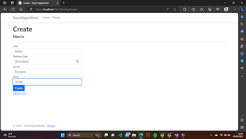

# Tugas5-PBKK
### Membuat NET Web CRUD Application  

### Proyek ini bertujuan memperkenalkan ASP.NET kepada mahasiswa sebagai bagian dari Tugas 5 PBKK B di Institut Teknologi Sepuluh Nopember. ASP.NET adalah kerangka kerja pengembangan aplikasi web yang dikembangkan oleh Microsoft yang menyediakan alat dan struktur yang kuat untuk membangun aplikasi web yang berskala dan aman. Keuntungan utama ASP.NET termasuk kemampuannya untuk berintegrasi dengan berbagai teknologi Microsoft lainnya, seperti SQL Server dan Azure, serta mendukung berbagai bahasa pemrograman, seperti C# dan VB.NET. ASP.NET juga dilengkapi dengan fitur keamanan yang kuat, manajemen sesi yang efisien, dan alat pengujian yang canggih, memungkinkan pengembang untuk lebih mudah membangun aplikasi web yang andal dan berkinerja tinggi.

### Razor Movie adalah sistem di mana pengguna dapat melakukan berbagai operasi CRUD (Create, Read, Update, Delete) pada sebuah situs web yang dibuat. Pengguna memiliki kemampuan untuk menambahkan film, menghapus film, mengeditnya, dan melihat daftar film yang telah ditambahkan.

### 1. Hasil Program

